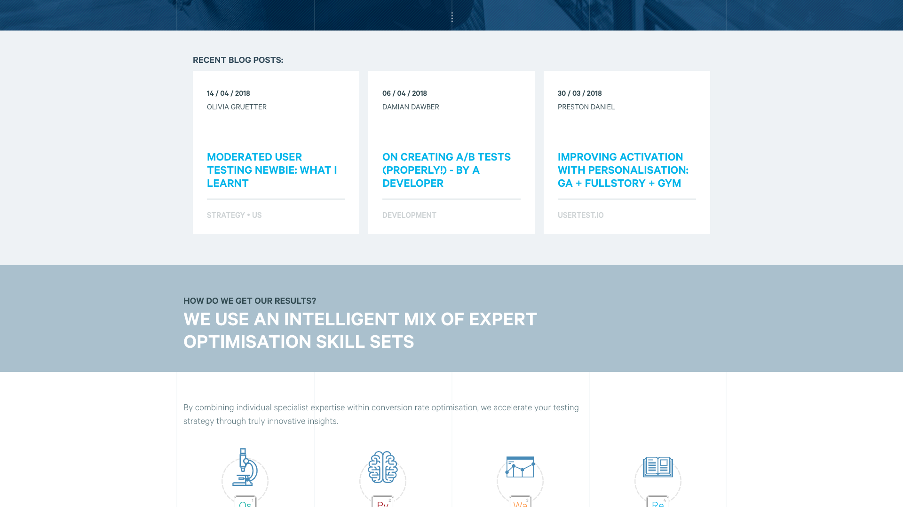
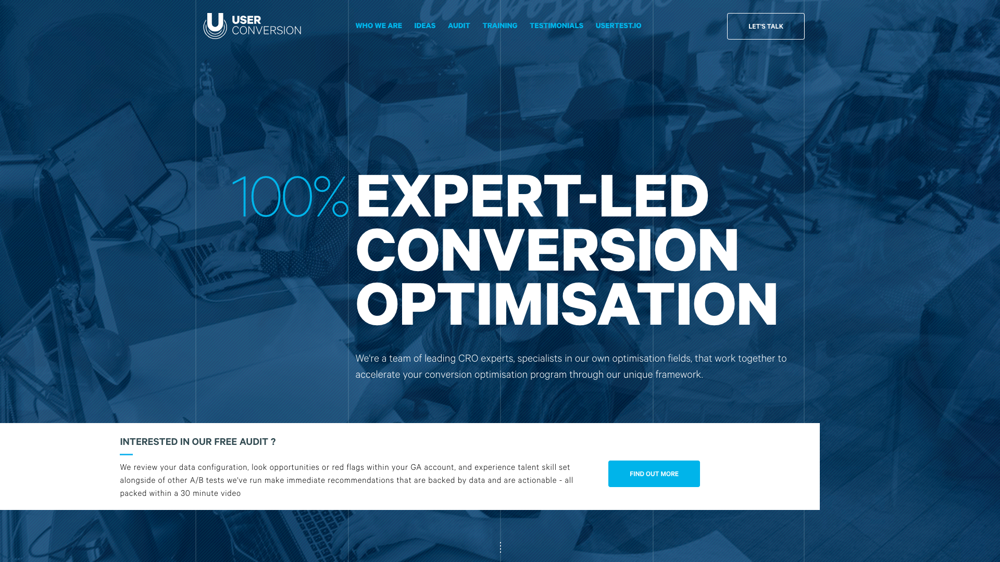

# User Conversion Assigment

#### Date: 28 / 10 / 2018

## Introduction
This project consists of files named design-1 & design-2 that are can be pasted into Chrome Developer Tools, whilst on the User Conversion Manchester website. The result will display 2 components that were developed to spec - I included a responsiveness touch to them.

**Component 1**

**Component 2**

## Lightweight Script
All injected scripts are to made as light weight as possible. So that it hardly impacts the performance of the client website;
a lot of the clients website's CSS were utilised as much as possible; things normally included such as the following below, were NOT included.

- Handling of Typography - adopted Calibri from UC website
- Normalise CSS + additional normalisation CSS scripts
- Using ES6 (except template literals) - classes & arrow functions requires more lines of core JS runtime code.

The aim was to keep it running as fast as possible - using ES5 JavaScript.

## Responsiveness
The A/B component was tested on viewports ranging 480px to 1920px.

Please Note: CSS Flexbox was used, thus website compatibility only starts at IE11 (with vendor prefix support) and beyond.

## Instructions of Use
Simply copy and paste the scripts **design-1.js** or **design-2.js** into Chrome Devtools console. The resulting outcome would be the the appearance of the component specified.

### Optimised scripts
These scripts **design-1-optimised.js** & **design-2-optimised.js** were simply;
1. Copy and pasted into [Babel](https://babeljs.io/repl) and compiled to ES5 - remove the use of string template, require less processing by the browser
2. This was then copied and pasted into [JSCompress](https://jscompress.com/) - the tool claim to reduce the size by up to 80% of there original size. Because the code written was very little, compress feel between 1% - 2% compression of original size.
